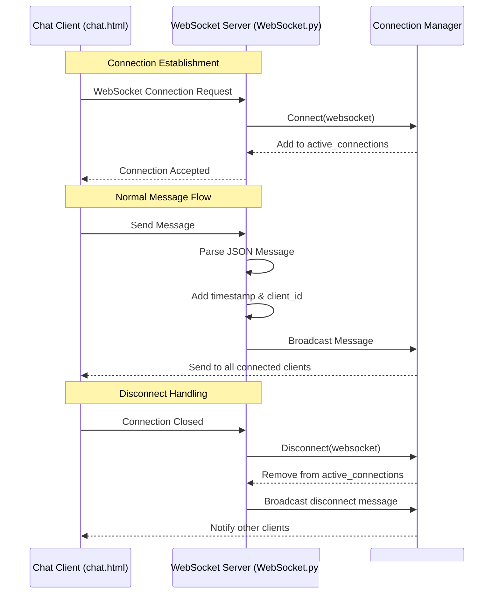

# WebSocket Chat Application Architecture




```mermaid
classDiagram
    class ConnectionManager {
        +List[WebSocket] active_connections
        +int connection_count
        +connect(websocket)
        +disconnect(websocket)
        +broadcast(message)
    }

    class FastAPI {
        +get("/")
        +websocket("/ws/{client_id}")
    }

    class WebSocketEndpoint {
        +websocket_endpoint(websocket, client_id)
        +handle_message(data)
        +handle_disconnect()
    }

    class ChatClient {
        +WebSocket connection
        +String clientId
        +connect()
        +sendMessage(message)
        +displayMessage(data)
        +handleDisconnect()
    }

    FastAPI --> ConnectionManager : uses
    FastAPI --> WebSocketEndpoint : defines
    WebSocketEndpoint --> ConnectionManager : uses
    ChatClient --> WebSocketEndpoint : connects to